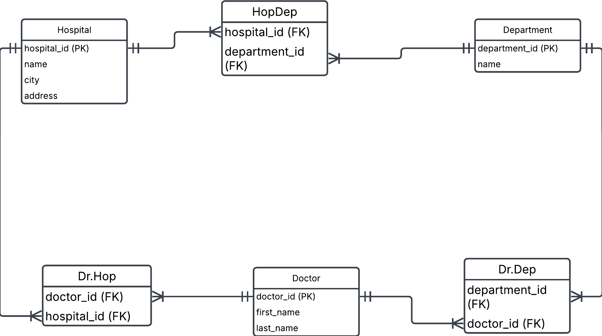

Going back to the hospital exercise from exercise0, task 1, we will build logical and physical data models. This is the conceptual data model after we've added the composite entities to take care of many-to-many relationships

a) Create a logical data model using lucidcharts

--
b) 
Identify different keys on the various entities

**Hospital-entity** : 'hospital_id' (primary key)

**Department-entity**: department_id (primary key)

**Doctor-entity**: doctor_id (primary key)

**HopDep composite entity**: 'hopdep_id' (primary key), hospital_id (foreign key), department_id (foreign key)

**Dr.Dep composite entity**: dr.dep_id (primary key), department_id (foreign key), doctor_id (foreign key)

**Dr.Hop composite entity**: dr.hop_id (primary key), doctor_id (foreign key), hospital_id (foreign key)

---
c) Identify child entities and parent entities. What makes them into parent/child relationships?

Parent entity: Hospital, Department, Doctor

Child: HopDep, Dr.Hop, Dr.Dep

---

d) Create a physical data model using dbdiagram

```json
TABLE Hospital {
  hospital_id INTEGER [PRIMARY KEY]
  name VARCHAR (50) [NOT NULL]
  city VARCHAR (50) [NOT NULL]
  adress VARCHAR (100) [NOT NULL]
}

TABLE HopDep {
  hopep_id INTEGER [PRIMARY KEY]
  hospital_id INTEGER [NOT NULL, ref: > Hospital.hospital_id]
  department_id INTEGER [NOT NULL, ref: > Department.department_id]
}

TABLE Department {
  department_id INTEGER [PRIMARY KEY]
  name VARCHAR (50) [NOT NULL]
}

TABLE Dr.Dep {
  dr_dep_id INTEGER [PRIMARY KEY]
  department_id INTEGER [NOT NULL, ref: > Department.department_id]
  doctor_id INTEGER [NOT NULL, ref: > Doctor.doctor_id]
}

TABLE Doctor {
  doctor_id INTEGER [PRIMARY KEY]
  first_name VARCHAR (50) [NOT NULL]
  last_name VARCHAR (50) [NOT NULL]
}

TABLE Dr.Hop {
  dr_hop_id INTEGER [PRIMARY KEY]
  hospital_id INTEGER [NOT NULL, ref: > Hospital.hospital_id]
  doctor_id INTEGER [NOT NULL, ref: > Doctor.doctor_id]
}
```

--- 
e) Create a few tables manually, insert given data plus some more, and try to manually link foreign keys to primary keys. Can you satisfy that a doctor can work at several departments and several hospitals?