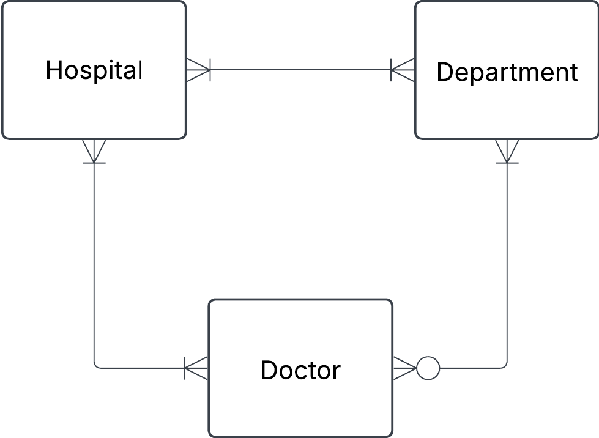
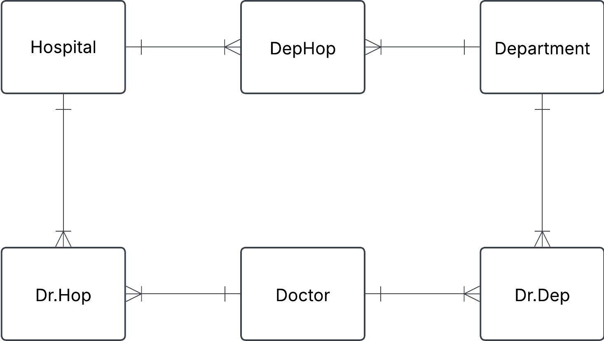

Exercise 0

Exercise 1
You have this json data, convert it into three tables: Hospital, Department and Doctor.
Fill these tables with data. Do this manually and not programmatically.

```json
{
  "hospital": "Sjukhusstock",
  "address": "Drottninggatan 3, Stockholm",
  "departments": [
    {
      "name": "Kardiologi",
      "doctors": [
        { "id": 1, "name": "Dr. Abra Abrahamson" },
        { "id": 2, "name": "Dr. Erika Eriksson" }
      ]
    },
    {
      "name": "Neurologi",
      "doctors": [{ "id": 3, "name": "Dr. Sven Svensson" }]
    }
  ]
}
```
### Solution:

Approach
- identify entities
- identify relationships and cardinalities
- create conceptual EDR
- create tables 


Initial naive conceptual ERD




---
**Hospital** 

| hospital_id | name         | adress          |
| ----------- | ------------ | --------------- |
| 1           | Sjukhusstock | Drottninggata 3 |

---
| department_id | name       |
| ------------- | ---------- |
| 1             | kardiologi |
| 2             | Neurologi  |

---

| doctor_id | name                 |
| --------- | -------------------- |
| 1         | Dr. Abra Abrahamsson |
| 2         | Dr. Erika Eriksson   |
| 3         | Dr. Sven Svensson    |

Refined with bridge tables to reflect many-to-many relationships



HopDep
| hopdep_id | hospital_id | department_id |
| --------- | ----------- | ------------- |
| 1         | 1           | 1             |
| 2         | 1           | 2             |

Dr.Dep
| dr.dep_id | doctor_id | department_id |
| --------- | --------- | ------------- |
| 1         | 1         | 1             |
| 2         | 2         | 1             |
| 3         | 3         | 2             |


Dr.Hop
| dr.hop_id | doctor_id | hospital_id |
| --------- | --------- | ------------- |
| 1         | 1         | 1             |
| 2         | 2         | 1             |
| 3         | 3         | 1             |


