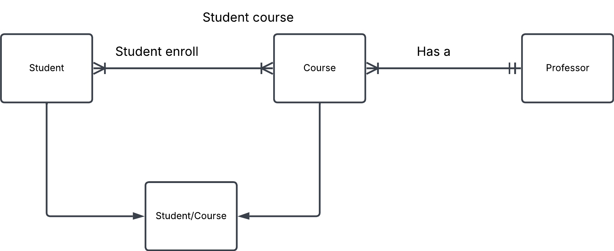

# Exercise 0

## 5. Student course

a/ and c/

b/
Student: student_id, student_firstname, student_lastname
| Course: course_id, course_name
| Professor: professor_id, professor_firstname, professor_lastname

d/
If one course does not have any students, that course will not be available for the school year

